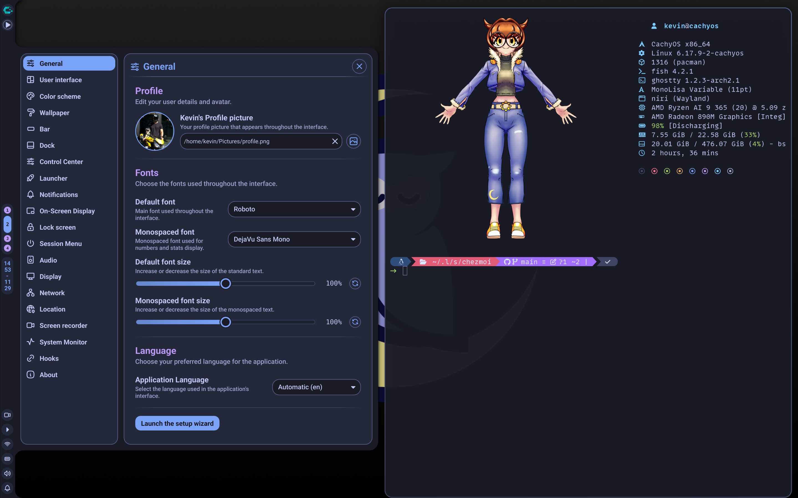

# Dotfiles

My personal dotfiles managed with [chezmoi](https://www.chezmoi.io/).



## Overview

These dotfiles are configured for [CachyOS](https://cachyos.org/) running [niri](https://yalter.github.io/niri/) as the Wayland compositor with [Noctalia shell](https://docs.noctalia.dev/). They install packages, set up the Warp pacman repo, enable system and user services, and install Claude Code automatically on first apply.

## Prerequisites

- A fresh CachyOS install with Gnome as the base desktop.
- `paru` (ships with CachyOS by default).
- `chezmoi`, `ghostty` (so the rest of the install runs in a nice terminal), and `helium-browser-bin` (so you can open this README in a browser) installed manually. Everything else — including `niri`, `warp-terminal`, and Claude Code — is installed by the automation on first apply.

## Installation

1. Install the bootstrap packages:

    ```fish
    paru -S chezmoi ghostty helium-browser-bin
    ```

    Then open this README in helium to follow along, and open `ghostty` for the next step.

2. Initialize and apply, capturing a log you can refer back to:

    ```fish
    chezmoi init --apply kevindiaz314 2>&1 | tee ~/first-apply.log
    ```

    On first apply, the automation will:

    - Add the `[warpdotdev]` pacman repository and sign its key.
    - Install every package listed in [.chezmoidata/packages.yaml](.chezmoidata/packages.yaml) via `paru` (pacman + AUR in one invocation).
    - Write `/etc/keyd/default.conf` with the keybindings defined in [run_onchange_after_25-setup-keyd-config.sh.tmpl](run_onchange_after_25-setup-keyd-config.sh.tmpl).
    - Enable every service in [.chezmoidata/services.yaml](.chezmoidata/services.yaml) (`keyd`, `tailscaled`, user `ssh-agent`, `ssh-add`, `noctalia`).
    - Install Claude Code via Anthropic's official installer (runs once; future updates via `claude update`).

    You will be prompted for your `sudo` password during the run.

3. Log out and back in (or reboot) so that newly enabled user services and PATH changes take effect.

## Post-install manual steps

The automation deliberately stops short of a few things that need your input or depend on external state:

- **Switch login session to niri** at the greeter (log out of Gnome, pick niri).
- **Set git identity**: `git config --global user.name "Kevin Diaz"` and `user.email …`.
- **Generate an SSH key** and symlink it to `~/.ssh/github_key` — `ssh-add.service` has `ConditionPathExists` on that path and silently no-ops until the file is there.
- **Authenticate Tailscale**: `sudo tailscale up`.
- **Log in to Nextcloud** and wait for a first sync.
- **Install MonoLisa fonts** once Nextcloud has synced:

    ```fish
    mkdir -p ~/.local/share/fonts
    cp ~/Nextcloud/Documents/MonoLisa/*.ttf ~/.local/share/fonts/
    fc-cache -fv
    ```

## Updating

After pulling new changes from the repo:

```fish
chezmoi apply -v
```

`run_onchange_*` scripts re-run automatically when their rendered content changes (for example, when [.chezmoidata/packages.yaml](.chezmoidata/packages.yaml) or [.chezmoidata/services.yaml](.chezmoidata/services.yaml) is edited).

## Troubleshooting

[CLAUDE.md](CLAUDE.md) at the repo root contains the full architecture and a troubleshooting runbook. If anything goes wrong on a fresh-machine apply, open a Claude Code session inside `~/.local/share/chezmoi` — the file is auto-loaded — and share `~/first-apply.log` along with output from the relevant runbook section.

For a one-shot verification of the whole automation (success or failure), paste the prompt from [docs/verify-first-apply.md](docs/verify-first-apply.md) into that Claude session.

## What's Included

### Window Manager

| Tool | Description |
|------|-------------|
| [niri](https://yalter.github.io/niri/) | Scrollable-tiling Wayland compositor |
| [Noctalia shell](https://docs.noctalia.dev/) | Shell/panel for niri |

### Terminal and Shell

| Tool | Description |
|------|-------------|
| [ghostty](https://ghostty.org/) | GPU-accelerated terminal emulator |
| [Warp](https://warp.dev/) | The terminal with Agents built in |
| [fish](https://fishshell.com/) | User-friendly shell |
| [atuin](https://atuin.sh/) | Shell history with sync |
| [zoxide](https://github.com/ajeetdsouza/zoxide) | Smarter cd command |
| [oh-my-posh](https://ohmyposh.dev/) | Prompt theme engine |

### Development

| Tool | Description |
|------|-------------|
| [LazyVim](https://www.lazyvim.org/) | Neovim config for the lazy |
| [lazygit](https://github.com/jesseduffield/lazygit) | Terminal UI for git |
| [Cursor](https://www.cursor.com/) | The AI-powered code editor |
| [opencode](https://opencode.ai/) | The AI coding agent built for the terminal |
| [Claude Code](https://claude.com/claude-code) | Anthropic's coding agent in the terminal |

### File Management and Utilities

| Tool | Description |
|------|-------------|
| [yazi](https://yazi-rs.github.io/) | Blazing fast terminal file manager |
| [zellij](https://zellij.dev/) | A terminal workspace with batteries included |
| [fastfetch](https://github.com/fastfetch-cli/fastfetch) | System information tool |

## Declarative Package Management

Packages are declared in [.chezmoidata/packages.yaml](.chezmoidata/packages.yaml) and installed by [run_onchange_before_20-install-packages.sh.tmpl](run_onchange_before_20-install-packages.sh.tmpl) via `paru -S --needed …`. The split between `pacman` and `aur` lists is organizational only — `paru` handles both. Editing either list is enough to trigger a re-install on the next `chezmoi apply` (the package names are inlined into the rendered script, so chezmoi detects the change automatically). Note: `--noconfirm` is deliberately omitted — you'll be prompted interactively for version choices, conflict resolution, and AUR build review.

Services are declared in [.chezmoidata/services.yaml](.chezmoidata/services.yaml) and enabled by [run_onchange_after_30-enable-services.sh.tmpl](run_onchange_after_30-enable-services.sh.tmpl) with `systemctl enable --now`, guarded by `is-enabled` so the script is safe to re-run.
